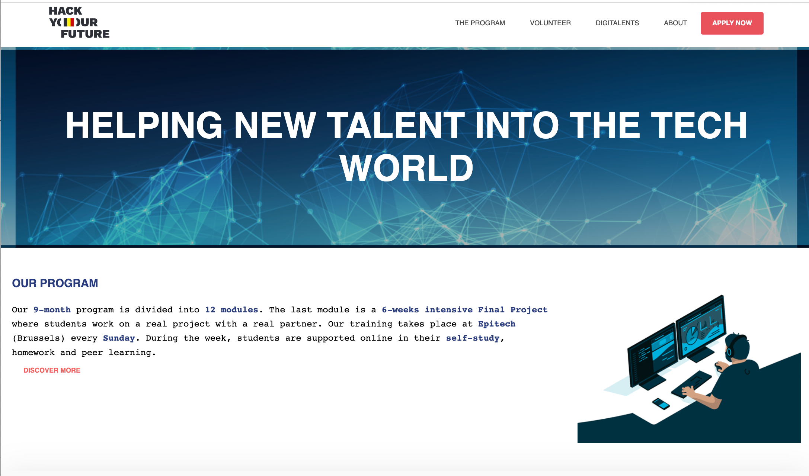

# Hack your future rebuild

> The HackYourFuture Belgium website provides information about the
> organization, its mission and values, the courses offered by the organization,
> and success stories of graduates. Users can also read about ways they can help
> the organization, such as through volunteering or donations.

## Table of contents

- [Hack your future rebuild](#hack-your-future-rebuild)
  - [Table of contents](#table-of-contents)
  - [General info](#general-info)
  - [Screenshots](#screenshots)
  - [Technologies](#technologies)
  - [Setup](#setup)
  - [Status](#status)
  - [Group Members](#group-members)

## General info

> A web site platform, the objective is to help job seeker to find training on
> development using agile methodology,html and css

## Screenshots

## Technologies

- Html5
- CSS3
- VSC code
- npm

## Setup

- clone the rep
- `npm install`

## Status

Project is: _done_

## Group Members

| Name                                            |
| ----------------------------------------------- |
| [Malik](https://github.com/Abdul-MalikSardalov) |
| [Fernando](https://github.com/FernandoYsita)    |
| [khalid](https://github.com/karol10cano)        |
| [Preethi](https://github.com/khalidkhan1212)    |
| [Zahira](https://github.com/ZahiraBella)        |
